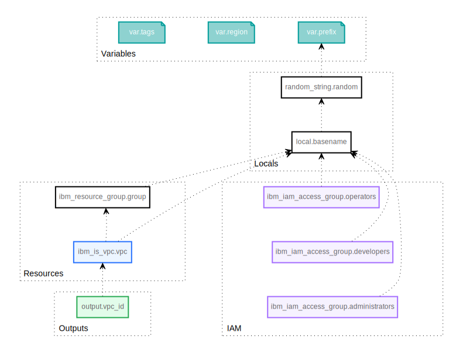

# Developer notes

## Creating a new release

The creation of a new release follows the flow

1. Make all your changes and test them.
1. Bump the version number in [ibm_catalog.json](../ibm_catalog.json).
1. Commit and push all changes.
1. Create a new release in GitHub or locally with the [GitHub CLI](https://cli.github.com/):
   ```sh
   gh release create v`cat ibm_catalog.json | jq -r '.products[] | .version'` --notes ""
   ```

## Building the Terraform diagram

The [Terraform diagram in svg](./graph.svg) was created with a combination of `terraform graph`, `dot graph.gv -Tsvg -ograph.svg` plus manual edits to make it look good. Most notably removing uninteresting links and grouping resources in clusters.


